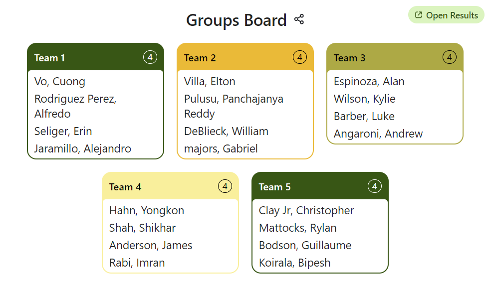

## Team 1: Data Definition Language (DDL)
## Team 2: Data Manipulation (DML) 
## Team 3: Data Query Language (DQL)
## Team 4: Data Control Language (DCL)
## Team 5: Transaction Control Language (TCL)

5-8 min presentation with examples (Either PowerPoint or Azure Data Studio) and demostrations.

For your sublanguage. Tell us what commands it encompasses and what they do. Setup some tests and show us cause and effects.